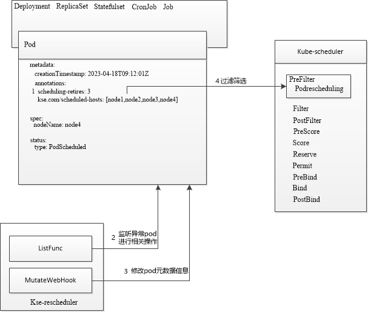

# kse-rescheduler


## 介绍

Kubernetes作为容器云的核心容器编排平台，其默认的异常Pod重启恢复机制存在天然局限，例如在Pod因为节点资源不够或节点硬件原因而导致异常退出的情况下，
Pod中的原地重启策略并不能解决Pod异常的问题，需要人工介入重调度Pod到其他节点。这限制了系统的自动容错能力，降低了服务的可靠性和高可用性。
为了解决这一问题，我们提出了一种优化调度策略，通过实现错误Pod的自动重调度引擎，即***kse-rescheduler***，提升容器云平台的自动容错能力。

## 设计思路

我们的设计思路如下所示：
* 用户可以在工作负载资源（如Deployment、StatefulSet）的描述中配置最大调度次数（*scheduling-retires*），该配置将记录在资源的元数据中。
* 引入一个调度控制器（*Kse-rescheduler*），用于监听集群中状态异常的Pod。对于每个异常的Pod，控制器将检查其所属工作负载资源元数据中记录的当前调度次数。如果当前调度次数不超过用户配置的最大调度次数，则将当前调度次数加1，并将Pod当前所在节点记录到已调度节点列表中。
* 接着，调度控制器（*Kse-rescheduler*）将删除该异常Pod。工作负载资源的控制器会自动重新创建Pod并进行调度，但会过滤掉已调度节点列表中的节点，从而实现错误Pod的重调度。

## 软件架构

***kse-rescheduler***重调度引擎由2个核心组件构成：Kse-rescheduler（控制器）、Kube-scheduler（扩展PreFilter阶段，命名为Podrescheduling）



- Kse-rescheduler
  - 1.在pod或者pod的控制器配置最大重调度次数参数（*scheduling-retires*）
  - 2.使用ListFunc插件监听集群异常pod并对其进行相关操作
  - 3.使用MutateWebHook插件对pod进行元数据信息修改

- Kube-scheduler
  - 4.kube-scheduler中的Podrescheduling插件对已经调度节点进行过滤筛选

## 镜像制作

镜像制作包含kse-rescheduler镜像的制作与kube-scheduler镜像的制作

1. 制作kse-rescheduler镜像
    ```bash
    $ git clone https://github.com/kylincloudnative/kse-rescheduler.git

    $ cd kse-rescheduler/

    $ make image-controller 
    ```

2. 制作kube-scheduler镜像
    ```bash
    $ git clone https://github.com/kylincloudnative/kse-rescheduler.git

    $ cd kse-rescheduler/

    $ make image-scheduler
    ```

## 部署

部署分为两个步骤：第一步部署kse-rescheduler这个controller，第二步部署替换k8s集群默认的kube-scheduler。

### 前提条件
* k8s 版本为v1.24.13
> 注：由于Podrescheduling插件基于kube-scheduler v1.24.13开发，您也可以基于其他k8s版本替换`go.mod`文件中的k8s版本号，重新编译kube-scheduler制作镜像

### 部署kse-rescheduler
  ```bash
   $ git clone https://github.com/kylincloudnative/kse-rescheduler.git
   
   $ cd kse-rescheduler/charts
       
   $ vim kse-rescheduler/values.yaml #替换成镜像步骤制作的kse-rescheduler镜像
    
   $ kubectl apply -f kse-rescheduler-ns.yaml
   
   $ helm -n kse-rescheduler install kse-rescheduler kse-rescheduler/
  ```
   
### 替换k8s集群默认的kube-scheduler

1. 备份 `kube-scheduler.yaml`

   ```bash
   cp /etc/kubernetes/manifests/kube-scheduler.yaml /etc/kubernetes/kube-scheduler.yaml
   ```

2. 创建`/etc/kubernetes/sched-cc.yaml`

    ```yaml
    apiVersion: kubescheduler.config.k8s.io/v1beta3
    kind: KubeSchedulerConfiguration
    leaderElection:
      # (Optional) Change true to false if you are not running a HA control-plane.
      leaderElect: true
    clientConnection:
      kubeconfig: /etc/kubernetes/scheduler.conf
    profiles:
    - schedulerName: default-scheduler
      plugins:
        multiPoint:
          enabled:
          - name: Podrescheduling
    ```
3. 修改`/etc/kubernetes/manifests/kube-scheduler.yaml`来运行带有Podrescheduling插件的kube-scheduler镜像
    
    需要做以下替换：
        
    ```diff
    16d15
    <     - --config=/etc/kubernetes/sched-cc.yaml
    17a17,18
    # 此处在/etc/kubernetes/sched-cc.yaml文件中已经定义，故需注释，无需重复定义
    >     - --kubeconfig=/etc/kubernetes/scheduler.conf
    >     - --leader-elect=true
    19,20c20
    # 镜像替换成镜像步骤制作的kube-scheduler镜像
    <     image: registry.kse.com/arm64/kube-scheduler:v0.24.13
    ---
    >     image: k8s.gcr.io/kube-scheduler:v1.24.13
    50,52d49
    <     - mountPath: /etc/kubernetes/sched-cc.yaml
    <       name: sched-cc
    <       readOnly: true
    60,63d56
    <   - hostPath:
    <       path: /etc/kubernetes/sched-cc.yaml
    <       type: FileOrCreate
    <     name: sched-cc
    ```
   
4. 完成修改后，kube-scheduler自动重启，如果是3个master节点，则3个节点都需做1，2，3步操作

## 使用

用户只需在各类控制器如deployment上配置annotations: scheduling-retries字段即可控制pod进行失败重调度的次数。如：

```yaml
apiVersion: apps/v1
kind: Deployment
metadata:
  annotations:
    # 如果该deployment控制的pod由于某些原因导致运行异常，则会自动对该pod重调度3次
    "scheduling-retries": "3"
  name: test
spec:
  replicas: 1
...
```


## 如何贡献

我们很高兴能有新的贡献者加入！
1.  Fork 本仓库
2.  新建 new-feature 分支
3.  提交代码
4.  新建 Pull Request